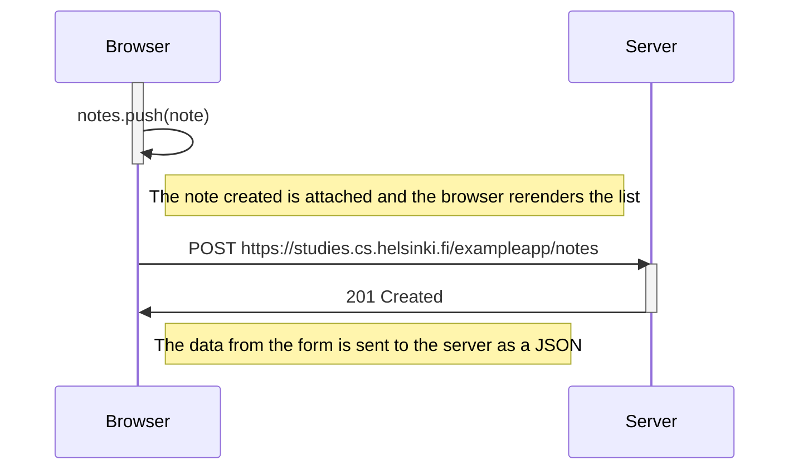

```mermaid
sequenceDiagram
    participant Browser
    participant Server

    activate Browser
    Browser->>Browser: notes.push(note) 
    deactivate Browser

    Note right of Browser: The note created is attached and the browser rerenders the list 

    Browser->>Server: POST https://studies.cs.helsinki.fi/exampleapp/notes
    activate Server
    Server->>Browser: 201 Created
    deactivate Server

    Note right of Browser: The data from the form is sent to the server as a JSON
```
